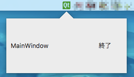

# Popover - QDialog base balloon shape widget

`QDialog` ベースの吹き出し付きポップアップ



## 利用方法

環境例

|項目|内容|
|-|-|
|アプリケーション名|test|
|ライブラリフォルダ|`libs`|

### 1)ソースを取得

```console
# git submodule add git@github.com:sharkpp/qtpopover.git libs/qtpopover
# git submodule update
```

### 2a)ソースを取り込む

#### 2a.1)プロジェクトファイル(`.pro`)を変更

アプリケーションの `.pro` を変更する。

変更例

```diff
+ # You can also select to disable deprecated APIs only up to a certain version of Qt.
+ #DEFINES += QT_DISABLE_DEPRECATED_BEFORE=0x060000    # disables all the APIs deprecated before Qt 6.0.0
+
+ include(./libs/qtpopover/sources/popover.pri)
+
+ SOURCES += \
+         main.cpp \
+         mainwindow.cpp \
```

### 2b)ライブラリを取り込む

#### 2b.1)ライブラリをビルド

`./libs/qtpopover/popover.pro` を `Qt Creator` で開きビルドする。

#### 2b.2)プロジェクトファイル(`.pro`)を変更

アプリケーションの `.pro` を変更する。

変更例

```diff
+ # You can also select to disable deprecated APIs only up to a certain version of Qt.
+ #DEFINES += QT_DISABLE_DEPRECATED_BEFORE=0x060000    # disables all the APIs deprecated before Qt 6.0.0
+
+ POPOVER_USE_STATIC_LIB=1
+ include(./libs/qtpopover/sources/popover.pri)
+
+ SOURCES += \
+         main.cpp \
+         mainwindow.cpp \
```

### 3)`QDialog` ベースのクラスを作る。

### 4)ソースの変更

変更例

```cpp
  #include <QApplication>
  
  TaskTrayPopup::TaskTrayPopup(QWidget *parent)
-     : QDialog(parent)
+     : Popover(parent)
      , ui(new Ui::TaskTrayPopup)
  {
      ui->setupUi(this);
```

### 5)ヘッダの変更

変更例

```cpp
  #ifndef TASKTRAYPOPUP_H
  #define TASKTRAYPOPUP_H
  
+ #include "popover.h"
  
  namespace Ui {
  class TaskTrayPopup;
  }
  
  class TaskTrayPopup
-         : public QDialog
+         : public Popover
  {
      Q_OBJECT
  
```

### 6)アプリケーションをビルド

完了


## クラスリファレンス

|定義|概要|
|-|-|
|`Popover::Popover(QWidget *parent = 0)`|コンストラクタ|

## 未実装

* 切り欠きの位置（右寄り/☑️中央/左寄り/なし）
* 吹き出しの角丸
* 非アクティブ化処理（まだ一部おかしい）

## ライセンス

© 2018 sharkpp

このアプリケーションは [MIT ライセンス](LICENSE.ja-JP) の下で提供されています。
